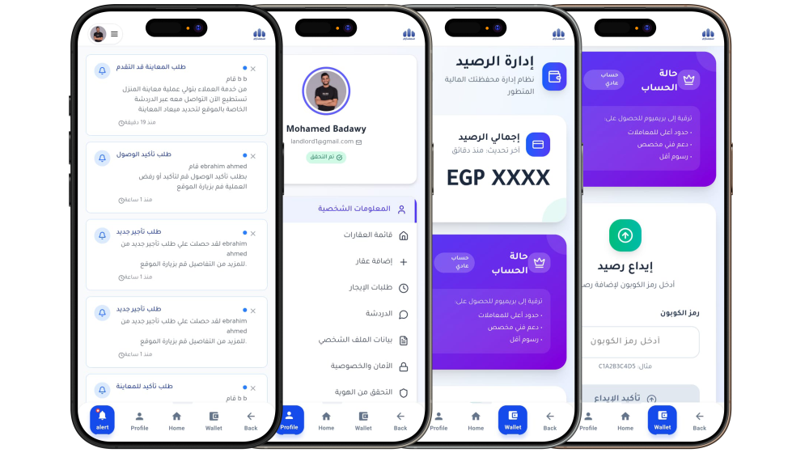

<div align="center">
  
</div>

# Semsary Mobile Application

A React Native mobile application that provides a seamless web view experience for the Semsary platform. This app serves as a mobile wrapper that delivers web-based functionality through an optimized mobile interface.

## Overview

The Semsary mobile app is built using React Native and leverages web view technology to provide users with access to the full Semsary platform on mobile devices. The app combines the performance of native mobile applications with the flexibility of web-based content.

<div align="center">
  
</div>

## Features

- **Web View Integration**: Seamless integration with Semsary web platform
- **Cross-Platform**: Runs on both iOS and Android devices
- **Optimized Performance**: Native mobile performance with web content
- **Responsive Design**: Adaptive UI that works across different screen sizes
- **Offline Support**: Basic offline functionality and caching
- **Push Notifications**: Real-time notifications for important updates
- **Deep Linking**: Support for deep links and navigation

## Technology Stack

- **React Native**: Cross-platform mobile development framework
- **React Native WebView**: For embedding web content
- **JavaScript/TypeScript**: Programming languages
- **Metro**: React Native bundler
- **Flipper**: Debugging and development tools

## Screenshots

<div align="center">
  <table>
    <tr>
      <td></td>
      <td></td>
      <td></td>
    </tr>
    <tr>
      <td></td>
      <td></td>
      <td></td>
    </tr>
  </table>
</div>

##  Download Now

<div align="center">
  
  ###  Ready to Experience Semsary?
  
  <a href="https://github.com/Semsary/Application/releases/download/1.0.0/application-920b5294-8cfd-4d8c-91ac-a79c7751f378.apk">
    
  </a>
  
  **📦 Latest Release:** `v1.0.0`  
  **📏 File Size:** ~55.1 MB  
  
  🔗 **All Releases:** [View on GitHub](https://github.com/Semsary/Application/releases)
  

</div>

## Project Structure

```
Application/
├── android/                 # Android-specific code
├── ios/                     # iOS-specific code
├── src/
│   ├── components/         # Reusable UI components
│   ├── screens/           # Application screens
│   ├── navigation/        # Navigation configuration
│   ├── services/          # API and external services
│   ├── utils/            # Utility functions
│   └── assets/           # Images, fonts, and other assets
├── package.json
├── metro.config.js
└── README.md
```
